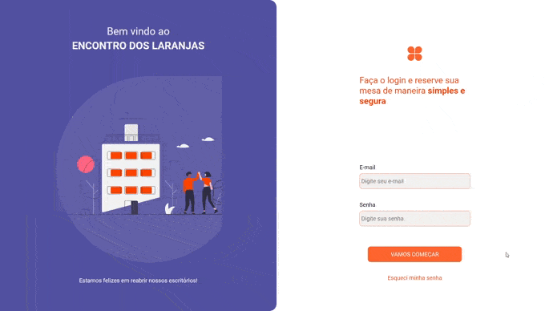

<h1 align="center"></h1>

<p align="center">Aplicação web desenvolvida para oferecer de forma simples o angendamento para usar os escritórios da FCamara. </p>

<p align="center">
  <a href="#computer-sobre-o-projeto">Sobre o Projeto</a> •
  <a href="#white_check_mark-features">Features</a> •
  <a href="#books-como-executar">Como executar</a> •
  <a href="#-Tecnologias">Tecnologias</a> •
  <a href="#hammer-Utilitários">Utilitários</a> •
  <a href="#-Equipe">Equipe</a> •
  <a href="#-licença">Licença</a>
</p>

---

**Para testar a aplicação <a href="http://134.209.220.223">clique aqui!</a><br>**
Emails de acesso de "admin1@admin.com até admin50@admin.com" e senha "123456". (Para testar com a funcionalidade de envio de e-mail, seguir os passos do "Como executar")

---
<h2 align="center">Demonstração de Uso</h2>



## :computer: Sobre o projeto

Com o ínicio da pandemia, muitas empresas tiveram que adotar o sistema de home office, e não foi diferente na FCamara. 

No cenário atual, já faz sentido a volta controlada aos escritórios, e o Encontro Dos Laranjas surgiu para auxiliar os consultores da FCamara em uma volta segura.

O Encontro dos Laranjas é uma aplicação web que vai auxiliar os consultores a agendarem sua volta ao escritório de forma simples, em menos de 30 segundos a sua estação de trabalho já está reservada, e claro, seguindo todos os protocolos de distanciamento social.

Projeto desenvolvido durante o **PROGRAMA DE FORMAÇÃO SEASON 2** oferecido pelo Grupo FCamara.

---
## :white_check_mark: Features
- [x] Login de usuário
- [x] Reservar uma estação de trabalho
- [x] Visualizar reservas ativas
- [x] Cancelar reservas ativas
---
## :books: Como executar

### :memo: Pré-requisitos

Antes de começar, você vai precisar ter instalado em sua máquina as seguintes ferramentas:
[PHP](https://www.php.net), [MySQL](https://www.mysql.com) (Você pode instalar os dois juntos
utilizando o [XAMPP](https://www.apachefriends.org/pt_br/index.html), [Composer](https://getcomposer.org) (ferramenta de gerenciamento de dependências do PHP).
Além disto é bom ter um editor para trabalhar com o código como [VSCode](https://code.visualstudio.com/)


### 🎲 Rodando o projeto

```bash
# Clone este repositório
$ git clone https://github.com/patricksb98/FCarama-Squad25

# Acesse a pasta do projeto no terminal/cmd
$ cd FCarama-Squad25

# Rodar o composer para baixar as dependências do projeto (pode demorar alguns minutos).
$ composer install

# Digite no terminal
$ copy .env.example .env

# Digite no terminal
$ php artisan key:generate

# Configurando o banco de dados (Arquivo .env)

DB_CONNECTION=mysql
DB_HOST=127.0.0.1 ("Endereço do seu banco de dados")
DB_PORT=3306 ("Porta usada para o banco de dados")
DB_DATABASE=fcamara ("Nome do Schema criado")
DB_USERNAME=root ("Seu usuário)
DB_PASSWORD= ??? ("Sua senha)
 
Como estamos seguindo do princípio de que os consultores da FCamara já possuem os seus acessos para sistemas
da empresa, não criamos uma tela para registro de consultores.
PARA MOTIVOS DE TESTE, ENTRAR NO ARQUIVO database/seeders/ConsultorSeeder.php e trocar os dados de acesso.
Colocar de preferência o seu e-mail pessoal para poder testar o sistema de envio de emails!

# Após seguir todos os passos acima, digitar o seguinte comando no terminal (para criar as tabelas e
 relacionamentos do DB)
$ php artisan migrate

# Digitar no terminal (para popular as tabelas)
$ php artisan db:seed

# Por fim, digitar no terminal
$ php artisan serve

# O servidor iniciará na porta:8000 - acesse http://localhost:8000
```
---
## 🛠 Tecnologias

As seguintes ferramentas foram usadas na construção do projeto:

- [PHP](https://www.php.net)
- [Laravel](https://laravel.com)
- [MySQL]()
- [HTML5](https://developer.mozilla.org/pt-BR/docs/Web/HTML)
- [CSS3](https://developer.mozilla.org/pt-BR/docs/Web/CSS)
- [JavaScript](https://developer.mozilla.org/pt-BR/docs/Web/JavaScript)
-------

## :hammer: Utilitarios

- Protótipo: [Figma](https://www.figma.com/file/icY0MwjPPMd66k2aJWJNTK/Hackathon---FCamara---Squad-25?node-id=94%3A37)
- Trello: [Trello](https://trello.com/b/BZmX4t4q/squad-25)
- Documentação Postman (Lembrando que a aplicação não é uma API, mas fui instruído pelos mentores a fazer a documentação mesmo assim, então algumas rotas podem não estar funcionando como estariam em uma API): [Postman](https://documenter.getpostman.com/view/16607104/U16kr5fG?fbclid=IwAR28QC5jsAZTkcF3q7681Kaw0u6C27P9MtL51eapbEQeiBAHFb0n2Q1no2c)
- Diagrama de Classes UML: [Drive](https://drive.google.com/file/d/1hoG5GH0al0ippMRfUIdJ7rdwLixqsVgL/view?usp=sharing)
- Userflow: [Drive](https://drive.google.com/file/d/19FPboYkv2_U175s_1Fv0Jo8se0yd2Pdt/view?usp=sharing)
- Documentação do Processo de UX: [Medium](https://medium.com/@mdudap2/encontro-dos-laranjas-uma-solu%C3%A7%C3%A3o-simples-e-segura-para-o-retorno-aos-escrit%C3%B3rios-da-fcamara-90f9d369ae29)

## 👨‍💻 Equipe
<table>
  <tr>
    <td align="center"><a href="https://www.linkedin.com/in/patrick-barbosa-7b1505137/"><br /><sub><b>Patrick Barbosa</b></sub></a><br /><a href="https://www.linkedin.com/in/patrick-barbosa-7b1505137/" title="Patrick">DEV</a></td>
    <td align="center"><a href="https://www.linkedin.com/in/bruno-costa-715959208/"><br /><sub><b>Bruno Costa</b></sub></a><br /><a href="https://www.linkedin.com/in/bruno-costa-715959208/" title="Bruno">DEV</a></td>
    <td align="center"><a href="https://www.linkedin.com/in/maria-eduarda-santos-0bb373b1/"><br /><sub><b>Maria Eduarda</b></sub></a><br /><a href="https://www.linkedin.com/in/maria-eduarda-santos-0bb373b1/" title="Duda">UX/UI</a></td>
    <td align="center"><a href="https://www.linkedin.com/in/jackeline-tanaka/"><br /><sub><b>Jackeline Tanaka</b></sub></a><br /><a href="https://www.linkedin.com/in/jackeline-tanaka/" title="Jack">UX/UI</a></td>
</tr>
</table>

---
## &#x1F4C4; Licença

[](https://github.com/patricksb98/FCarama-Squad25/blob/master/LICENSE)


